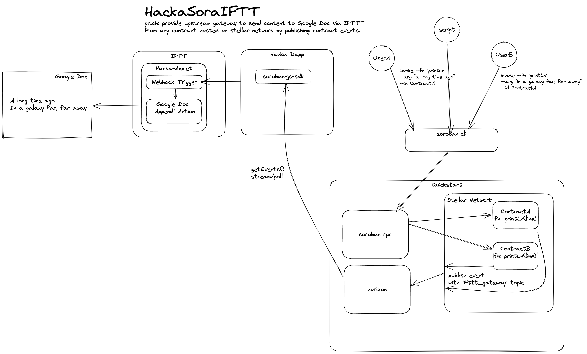

### IFTTT HackSora

Hack up [Stellar Soroban smart contract](https://soroban.stellar.org/docs) events integrated to IFTTT triggers and actions. 





Uses components:

1. [IFTTT PaaS](https://ifttt.com).
2. IFTTT Applet, the appliet connects IFTTT Webhook trigger to IFTTT Google Docs action.
3. Quickstart for Soroban RPC Server, Horizon API server, Soroban Core.
4. A smart contract, has a `printLn(line)` function, when invoked will trigger contract to emit event with line as payload.

#### Run time

* Create an IFTTT free account, in IFTTT->My Applets, create new applet to link smart contract events to Google Doc actions:

  * `If This` - choose webhook 'receive request' trigger from the IFTTT service catalog, get the ifttt url of the webhook service for user account and use that as `IFTTT_WEBHOOK_URL`
      
  * `Then That` - choose Google Docs, 'append to' action

* Launch [quickstart image for soroban development](https://github.com/stellar/quickstart#soroban-development) on your local machine for `standalone` or `futurenet` networks:
   ```
   # futurenet 
   docker run --platform linux/amd64 --rm -it -p "8001:8000" --name stellar_futurenet stellar/quickstart:soroban-dev --futurenet --enable-soroban-rpc 

   # local standalone 
   docker run --platform linux/amd64 --rm -it -p "8000:8000" --name stellar_standalone stellar/quickstart:soroban-dev --standalone --enable-soroban-rpc 
   ```

* Use [Laboratory Generate Keypair](https://laboratory.stellar.org/#account-creator?) to generate a new test account key pair to be used as user account for deploying and invoking example contract using soroban cli:  
```
# on standalone network published by quickstart locally:
curl http://localhost:8000/friendbot?addr=<keypair_public key>
# on futurenet
curl https://friendbot-futurenet.stellar.org/?addr=<keypair_public key>
```

* start the local dapp service for hacka IFTTT demo, to push events to IFTTT.

* Compile the smart contract to wasm 
    
* Deploy the contract to the network via the cli tool against rpc server from quickstart 

* invoke the contract `printLn(line)` fn from cli tool, passing new line text each time.

* watch the google doc update with new lines in real time.


  
      
    
    
  


